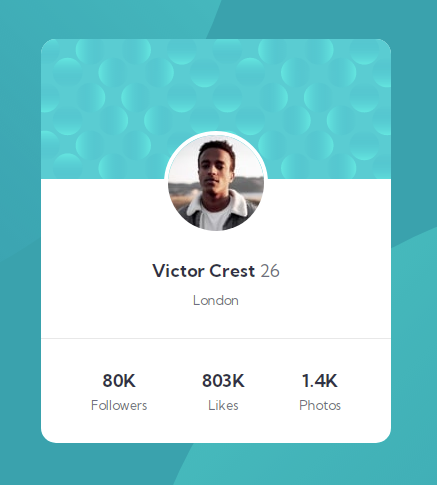

# Frontend Mentor - Profile card component solution

This is a solution to the [Profile card component challenge on Frontend Mentor](https://www.frontendmentor.io/challenges/profile-card-component-cfArpWshJ). Frontend Mentor challenges help you improve your coding skills by building realistic projects. 

## Table of contents

- [Overview](#overview)
  - [The challenge](#the-challenge)
  - [Screenshot](#screenshot)
  - [Links](#links)
- [My process](#my-process)
  - [Built with](#built-with)
  - [What I learned](#what-i-learned)
- [Author](#author)
- [Acknowledgments](#acknowledgments)

## Overview

### The challenge

- Build out the project to the designs provided

### Screenshot



### Links

- [Live Site URL](https://anirog.github.io/fem-profile-card-component/)

## My process

### Built with

- Flexbox

### What I learned

I leanred how to use background images and how to position the images.

```css
background-image: url(images/bg-pattern-top.svg), url(images/bg-pattern-bottom.svg);
    background-repeat: no-repeat, no-repeat;
    background-position: right 48vw bottom 40vh, left 45vw top 44vh;
```

## Author

- Website - [Larrie](https://larrieknights.com)
- Frontend Mentor - [@Anirog](https://www.frontendmentor.io/profile/Anirog)
- Twitter - [@y512kilobytes](https://www.twitter.com/512kilobytes)
